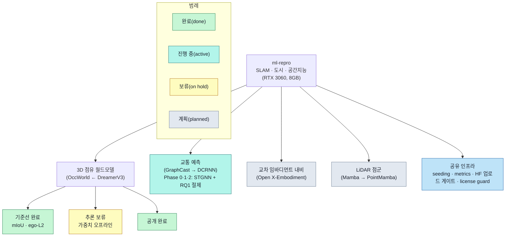
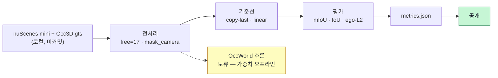

# ml-repro — ML 재현 과제 모노레포

[](LICENSE)

> 🇬🇧 **[English README](README.md)**

최근 ML 돌파(DreamerV3, OccWorld 등)를 게이밍PC(**RTX 3060, 8GB**)나 Colab 수준에서 SLAM·도시·공간지능 방향으로 재설계하여 **축소 재현**한다. 목적은 SOTA 재현이 아니라 **원리 재현·학습**이다.

## 프로젝트 목적
최근 ML/DL/RL 돌파 사례(예: **DreamerV3**, **OccWorld**)를 소비자용 하드웨어나 Colab에서 **원리 중심으로 축소 재현**하고, SLAM·도시·공간지능 문제로 재설계한다. SOTA 수치 재현이 목적이 **아니라** 학습·재현이 목적이다.

## 핵심 원칙 — 결과를 지어내지 않는다
실제 실행값(`metrics.json`)만 보고한다. 미검증·미실행은 **한계**로 명시하며 달성한 것처럼 쓰지 않는다. 데이터셋·라벨·체크포인트는 **절대 커밋하지 않는다**(`.gitignore` 차단).

## 개요 (Overview)

### 프로젝트 구조


### 3D 점유 월드모델 — 재현 파이프라인


### 예시 시나리오
**(A) 목표 시나리오 — 이 작업이 지향하는 것(OccWorld의 비전):**
> 차량이 교차로에 접근할 때, 과거 몇 프레임의 3D 점유를 입력하면 월드모델이 향후 3초의 주변 점유 변화(보행자·차량 이동·주행가능영역)와 자차 궤적을 함께 예측해, 계획 모듈이 충돌 위험을 사전에 평가한다.

이는 OccWorld가 지향하는 **목표**이며, 우리가 구현했다는 뜻이 **아니다**.

**(B) 현재 검증분 — 실제로 돌린 것:**
> copy-last·linear 기준선으로 실 nuScenes-mini + Occ3D에서 미래 점유(mIoU/IoU)·자차 궤적(ego-L2)을 실측했다. OccWorld **모델 추론은 보류**(가중치 오프라인)라 모델↔기준선 대비는 미확보.

(A) 목표 시나리오를 우리가 구현했다고 오해되지 않도록 (B)와 분명히 구분한다.

## 진행 상태 (정직하게)
| 작업 | 초점 | 상태 |
|---|---|---|
| **3D 점유 월드모델** (OccWorld ← DreamerV3) | 미래 점유 + 자차 궤적 예측 | 기준선 **완료**(mIoU · ego-L2) · 추론 **보류**(가중치 오프라인) · **공개 완료** |
| 교통 예측 (GraphCast → DCRNN) | 도시 교통 시공간 | **Phase 0·1·2 완료**: METR-LA 데이터 + 기준선 + 소형 STGNN 학습·인접행렬 절제(RQ1) 실측 · SOTA 아님(원리 재현) |
| 교차 임바디먼트 내비 (Open X-Embodiment) | 로봇 몸체 간 내비게이션 | **계획됨**(미착수) |
| LiDAR 점군 (Mamba → PointMamba) | 점군 이해 | **계획됨**(미착수) |

## 실측 결과 (실제 실행값)
실 nuScenes **v1.0-mini**, 프로토콜 과거 2s → 미래 3s @ 2Hz, CPU. **검증 split = 2씬 / 63윈도우** (⚠️ 표본이 작아 일반화 주의).

**점유 — copy-last 기준선(= 논문 "Copy&Paste" 정의), 실 Occ3D gts** (camera-mask 적용, free 클래스 17 제외):

| 지표 (%) | @1s | @2s | @3s |
|---|---|---|---|
| 미래 mIoU | 10.75 | 6.40 | 5.10 |
| 이진 IoU | 27.21 | 21.11 | 18.35 |

**ego 궤적 — L2 (m), 누적평균:**

| 모델 | L2@1s | L2@2s | L2@3s |
|---|---|---|---|
| copy-last (persistence) | 3.89 | 6.46 | 9.00 |
| linear-extrapolation (등속) | 0.45 | 1.10 | 2.01 |
| OccWorld (사전학습 추론) | — | — | — (보류) |

> 위 수치는 **우리 실측값**이며 논문 수치가 아니다. 움직이는 차량에 대해 등속 외삽이 persistence를 크게 앞서는 것은 예상되는 결과다.

### 교통 예측 — STGNN + 기준선 (실 METR-LA)
실 METR-LA(207센서, 5분 간격), 시간순 70/10/20, **test split = 6,850 윈도우**, masked MAE(결측=0), 원 단위(mph). 소형 STGNN(2-layer·hidden 32, RTX 3060, ~5분/모드, VRAM ~1.4GB)을 인접행렬 4모드로 학습해 기준선과 비교:
- **STGNN (learned 인접행렬)** MAE **3.00 / 3.50 / 4.28** @15/30/60분 — copy-last(4.02/5.09/6.80)를 전 지평, seasonal-HA(4.19 평탄)를 15/30분에서 이김. 60분은 HA 가 근소 우위(4.19 vs 4.28).
- **RQ1 (고정 vs 학습 인접행렬):** learned(4.28@60m) > fixed 도로망(4.89) > identity/그래프없음(4.95) — **인접행렬 학습이 고정 도로망보다 낫다**.
- **RQ2 (오차 누적):** STGNN-learned 스텝당 MAE 기울기 0.155 vs copy-last 0.332 — STGNN 이 약 절반만 누적(seasonal-HA 는 구조상 평탄).
- **SOTA 아님**(원리 재현): 우리 소형 모델은 DCRNN 논문(2.77/3.15/3.60)에 못 미침. PEMS-BAY 미실측.

상세: 과제 카드 [`tasks/task-02-traffic-stgnn/README.md`](tasks/task-02-traffic-stgnn/README.md) · [`metrics.json`](tasks/task-02-traffic-stgnn/results/stgnn-metr-la-20260704T053515Z/metrics.json).

## Phase 2 — OccWorld 추론이 보류된 이유 (외부요인)
OccWorld 사전학습 가중치·temporal pkl은 저자 **Tsinghua cloud(Seafile) 링크**로만 배포되는데, 이 링크가 **현재 비활성**이다(브라우저·CLI 모두 "share link not found"; 실제 토큰이 가짜 토큰과 동일하게 반응). 모델 수치를 지어낼 수 없으므로 **OccWorld↔기준선 대비 행은 공란으로 둔다.** [`ISSUE_phase2_blocked.md`](tasks/task-01-occworld-spatial/ISSUE_phase2_blocked.md) 참조. 링크 복구 또는 미러 확보 시 재개한다.

## 재현 방법 (점유 기준선)
```bash
# 1) 데이터 취득 안내(수동; nuScenes/Occ3D는 등록 필요 — 자동 다운로드 없음)
bash tasks/task-01-occworld-spatial/scripts/download_data.sh --subset mini
# 2) mini temporal info 생성(무설치) + 기준선 평가(실 gts)
python tasks/task-01-occworld-spatial/scripts/build_mini_infos.py
python tasks/task-01-occworld-spatial/scripts/eval_ego_baseline.py
python tasks/task-01-occworld-spatial/scripts/eval_occ_baseline.py
```
상세: [`PROJECT_GUIDELINE.md`](PROJECT_GUIDELINE.md), 과제 카드 [`tasks/task-01-occworld-spatial/README.md`](tasks/task-01-occworld-spatial/README.md).

## References (인용 논문)
> 이 목록은 구현된 작업 기준이다: **3D 점유 월드모델** **및 교통 예측**(데이터+기준선 완료). 교통 논문(GraphCast / DCRNN / Graph WaveNet)은 이제 실제 사용 중이며 [`CITATIONS.md`](CITATIONS.md)에 등재돼 있다. 아직 미착수인 작업(교차 임바디먼트 내비, LiDAR 점군)은 착수 시 해당 논문을 추가한다. BibTeX: [`CITATIONS.md`](CITATIONS.md).

- **[앵커]** Hafner, D., Pasukonis, J., Ba, J., & Lillicrap, T. (2025). *Mastering diverse control tasks through world models.* **Nature, 640, 647–653.** DOI [10.1038/s41586-025-08744-2](https://doi.org/10.1038/s41586-025-08744-2) [SCI(E)].
  — DreamerV3: 이 프로젝트가 축소 재현하는 월드모델 원리.
- **[브리지]** Zheng, W., Chen, W., Huang, Y., Zhang, B., Duan, Y., & Lu, J. (2024). *OccWorld: Learning a 3D Occupancy World Model for Autonomous Driving.* **ECCV 2024.** arXiv [2311.16038](https://arxiv.org/abs/2311.16038), DOI [10.1007/978-3-031-72624-8_4](https://doi.org/10.1007/978-3-031-72624-8_4).
  — 우리가 따르는 구체 모델 구조와 Copy&Paste 기준선 정의.
- **[데이터셋]** Caesar, H., et al. (2020). *nuScenes: A multimodal dataset for autonomous driving.* **CVPR 2020, 11618–11628.** DOI [10.1109/CVPR42600.2020.01164](https://doi.org/10.1109/CVPR42600.2020.01164).
  — 기반 주행 데이터셋(우리는 ego 궤적에 v1.0-mini 서브셋 사용).
- **[점유 라벨]** Tian, X., Jiang, T., Yun, L., Wang, Y., Wang, Y., & Zhao, H. (2023). *Occ3D: A Large-Scale 3D Occupancy Prediction Benchmark for Autonomous Driving.* arXiv [2304.14365](https://arxiv.org/abs/2304.14365).
  — mIoU/IoU에 쓰는 3D 시맨틱 점유 정답(`gts`)의 출처.
- **[교통 · 앵커]** Lam, R., et al. (2023). *Learning skillful medium-range global weather forecasting.* **Science, 382, 1416–1421.** DOI [10.1126/science.adi2336](https://doi.org/10.1126/science.adi2336) [SCI(E)].
  — GraphCast: 교통 STGNN이 도시 규모로 대응하는 격자→그래프→롤아웃 패러다임.
- **[교통 · 브리지]** Li, Y., Yu, R., Shahabi, C., & Liu, Y. (2018). *DCRNN: Data-Driven Traffic Forecasting.* **ICLR 2018.** arXiv [1707.01926](https://arxiv.org/abs/1707.01926). · Wu, Z., et al. (2019). *Graph WaveNet for Deep Spatial-Temporal Graph Modeling.* **IJCAI 2019.** DOI [10.24963/ijcai.2019/264](https://doi.org/10.24963/ijcai.2019/264).
  — 확산/adaptive 인접행렬 STGNN과 METR-LA/PEMS-BAY 벤치마크·기준선 정의.

## 데이터 출처·라이선스
- **코드(이 저장소):** **MIT License** — [`LICENSE`](LICENSE) 참조. 우리가 작성한 스크립트·지표·config에 적용.
- **데이터는 MIT 적용 대상이 아니며, 이 저장소에 포함되지 않는다:**
  - **nuScenes** — **비상업(CC BY-NC-SA 4.0)**, 계정 등록 필요, **재배포 금지**.
  - **Occ3D-nuScenes** — nuScenes 이용약관(비상업) 종속.
  - 데이터는 원 라이선스에 따라 **사용자가 직접 등록·취득**해야 한다. 이 저장소에는 **원데이터·라벨·모델 가중치가 없다**(`.gitignore` 차단).

## Contact / Author
- **Author:** urbsn4i-sw (GitHub)
- **Email:** urban4i.sw@gmail.com
- 문의·재현 이슈는 GitHub Issues 또는 위 이메일로. 학습·재현 목적의 비상업 저장소입니다.
