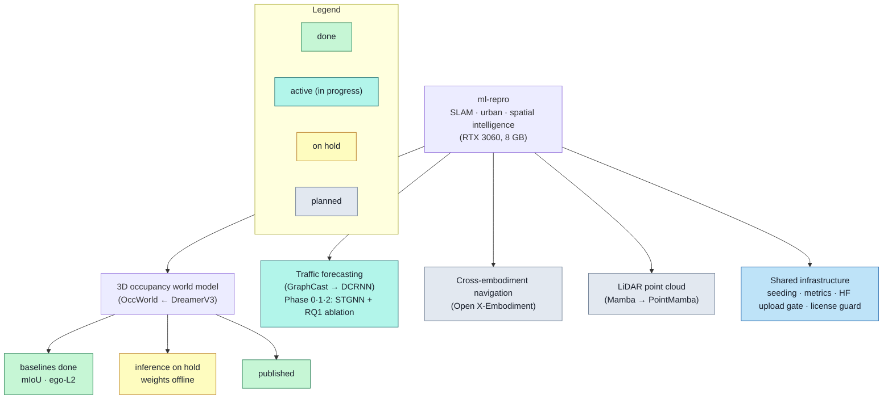
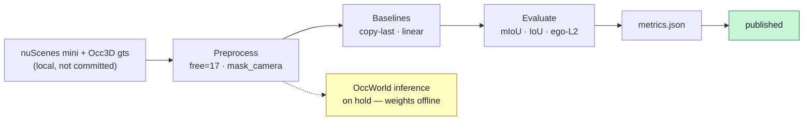

# ml-repro — ML Reproduction Monorepo

[](LICENSE)

> 🇰🇷 **[한국어 README](README.ko.md)**

Reproducing recent ML breakthroughs (DreamerV3, OccWorld, …) at small scale on a gaming PC (**RTX 3060, 8 GB**) or Colab, redesigned toward SLAM / urban / spatial-intelligence tasks. The goal is **learning the principles, not matching SOTA**.

## Purpose
Take recent ML/DL/RL breakthroughs (e.g. **DreamerV3**, **OccWorld**) and reproduce their **core principles** at reduced scale on consumer hardware or Colab, redesigned toward SLAM / urban / spatial-intelligence problems. This is a study / reproduction repo — **not** an attempt to match state-of-the-art numbers.

## Core principle — do not fabricate results
Only values from actual runs (`metrics.json`) are reported. Anything unverified or not run is stated explicitly as a **limitation**, never presented as if achieved. Datasets, labels, and checkpoints are **never committed** (blocked by `.gitignore`).

## Overview

### Project structure


### 3D occupancy world model — reproduction pipeline


### Example scenario
**(A) Target scenario — what this line of work aims at (OccWorld's vision):**
> When a vehicle approaches an intersection, given the past few frames of 3D occupancy, a world model forecasts the next ~3 s of surrounding occupancy change (pedestrians, vehicles, drivable area) together with the ego trajectory, so a planner can assess collision risk in advance.

This describes the **goal** OccWorld targets — it does **not** mean we implemented it.

**(B) What we actually validated — what really ran:**
> copy-last and linear baselines measured future occupancy (mIoU / IoU) and ego trajectory (ego-L2) on real nuScenes-mini + Occ3D. OccWorld **model inference is on hold** (weights offline), so the model-vs-baseline comparison is not available.

Kept explicitly separate from (A), so the target vision is not mistaken for our implementation.

## Status (honest)
| Work | Focus | Status |
|---|---|---|
| **3D occupancy world model** (OccWorld ← DreamerV3) | future occupancy + ego forecasting | baselines **done** (mIoU · ego-L2) · inference **on hold** (weights offline) · **published** |
| Traffic forecasting (GraphCast → DCRNN) | urban traffic spatio-temporal | **Phase 0·1·2 done**: METR-LA data + baselines + small STGNN trained with adjacency ablation (RQ1) measured · not SOTA (principle reproduction) |
| Cross-embodiment navigation (Open X-Embodiment) | navigation across robot bodies | **Planned** (not started) |
| LiDAR point cloud (Mamba → PointMamba) | point-cloud understanding | **Planned** (not started) |

## Measured results (real runs)
Real nuScenes **v1.0-mini**, protocol past 2s → future 3s @ 2 Hz, CPU. **Validation split = 2 scenes / 63 windows** (⚠️ small sample — do not over-generalize).

**Occupancy — copy-last baseline (= paper "Copy&Paste" definition), real Occ3D gts** (camera-mask applied, free class 17 excluded):

| Metric (%) | @1s | @2s | @3s |
|---|---|---|---|
| future mIoU | 10.75 | 6.40 | 5.10 |
| binary IoU | 27.21 | 21.11 | 18.35 |

**Ego trajectory — L2 (m), cumulative average:**

| Model | L2@1s | L2@2s | L2@3s |
|---|---|---|---|
| copy-last (persistence) | 3.89 | 6.46 | 9.00 |
| linear-extrapolation (constant velocity) | 0.45 | 1.10 | 2.01 |
| OccWorld (pretrained inference) | — | — | — (blocked) |

> These are **our** measurements, not paper numbers. Constant-velocity extrapolation clearly beats persistence for a moving ego vehicle, as expected.

### Traffic forecasting — STGNN + baselines (real METR-LA)
Real METR-LA (207 sensors, 5-min), chronological 70/10/20, **test split = 6,850 windows**, masked MAE (null=0), original units (mph). A small STGNN (2-layer, hidden 32, RTX 3060, ~5 min/mode, ~1.4 GB VRAM) trained under 4 adjacency modes vs the baselines:
- **STGNN (learned adjacency)** MAE **3.00 / 3.50 / 4.28** @15/30/60 min — beats copy-last (4.02/5.09/6.80) at every horizon and seasonal-HA (4.19 flat) at 15/30 min; at 60 min HA is marginally better (4.19 vs 4.28).
- **RQ1 (fixed vs learned adjacency):** learned (4.28 @60m) > fixed road-graph (4.89) > identity/no-graph (4.95) — **learning the adjacency beats the fixed road graph**.
- **RQ2 (error accumulation):** STGNN-learned per-step MAE slope 0.155 vs copy-last 0.332 — the STGNN accumulates error ~half as fast (seasonal-HA is flat by construction).
- **Not SOTA** (principle reproduction): our small model trails DCRNN's paper numbers (2.77/3.15/3.60); PEMS-BAY not run.

Details: task card [`tasks/task-02-traffic-stgnn/README.md`](tasks/task-02-traffic-stgnn/README.md) · [`metrics.json`](tasks/task-02-traffic-stgnn/results/stgnn-metr-la-20260704T053515Z/metrics.json).

## Phase 2 — why OccWorld inference is blocked (external factor)
OccWorld's pretrained weights and temporal pkl are distributed only via the authors' **Tsinghua cloud (Seafile) links**, which are **currently inactive** ("share link not found" for both browser and CLI; a real token behaves identically to a bogus one). We cannot fabricate the model's numbers, so the **OccWorld-vs-baseline row is left blank**. See [`ISSUE_phase2_blocked.md`](tasks/task-01-occworld-spatial/ISSUE_phase2_blocked.md). Work resumes if the links are restored or a mirror is found.

## Reproduce (occupancy baselines)
```bash
# 1) data acquisition guide (manual; nuScenes/Occ3D need registration — no auto-download)
bash tasks/task-01-occworld-spatial/scripts/download_data.sh --subset mini
# 2) build mini temporal infos (stdlib only) + baseline evals (real gts)
python tasks/task-01-occworld-spatial/scripts/build_mini_infos.py
python tasks/task-01-occworld-spatial/scripts/eval_ego_baseline.py
python tasks/task-01-occworld-spatial/scripts/eval_occ_baseline.py
```
Details: [`PROJECT_GUIDELINE.md`](PROJECT_GUIDELINE.md), task card [`tasks/task-01-occworld-spatial/README.md`](tasks/task-01-occworld-spatial/README.md).

## References
> These references cover the **implemented work**: the 3D occupancy world model **and** traffic forecasting (data + baselines done). Traffic papers (GraphCast / DCRNN / Graph WaveNet) are now in use and listed in [`CITATIONS.md`](CITATIONS.md). The still-unstarted tasks (cross-embodiment navigation, LiDAR point cloud) will add their papers when work starts. BibTeX: [`CITATIONS.md`](CITATIONS.md).

- **[Anchor]** Hafner, D., Pasukonis, J., Ba, J., & Lillicrap, T. (2025). *Mastering diverse control tasks through world models.* **Nature, 640, 647–653.** DOI [10.1038/s41586-025-08744-2](https://doi.org/10.1038/s41586-025-08744-2) [SCI(E)].
  — DreamerV3: the world-model principle this project reproduces at small scale.
- **[Bridge]** Zheng, W., Chen, W., Huang, Y., Zhang, B., Duan, Y., & Lu, J. (2024). *OccWorld: Learning a 3D Occupancy World Model for Autonomous Driving.* **ECCV 2024.** arXiv [2311.16038](https://arxiv.org/abs/2311.16038), DOI [10.1007/978-3-031-72624-8_4](https://doi.org/10.1007/978-3-031-72624-8_4).
  — The concrete model architecture and Copy&Paste baseline definition we follow.
- **[Dataset]** Caesar, H., et al. (2020). *nuScenes: A multimodal dataset for autonomous driving.* **CVPR 2020, 11618–11628.** DOI [10.1109/CVPR42600.2020.01164](https://doi.org/10.1109/CVPR42600.2020.01164).
  — Base driving dataset (we use the v1.0-mini subset for ego trajectories).
- **[Occupancy labels]** Tian, X., Jiang, T., Yun, L., Wang, Y., Wang, Y., & Zhao, H. (2023). *Occ3D: A Large-Scale 3D Occupancy Prediction Benchmark for Autonomous Driving.* arXiv [2304.14365](https://arxiv.org/abs/2304.14365).
  — Source of the 3D semantic occupancy ground truth (`gts`) used for mIoU/IoU.
- **[Traffic · Anchor]** Lam, R., et al. (2023). *Learning skillful medium-range global weather forecasting.* **Science, 382, 1416–1421.** DOI [10.1126/science.adi2336](https://doi.org/10.1126/science.adi2336) [SCI(E)].
  — GraphCast: the grid→graph→rollout paradigm the traffic STGNN mirrors at city scale.
- **[Traffic · Bridge]** Li, Y., Yu, R., Shahabi, C., & Liu, Y. (2018). *DCRNN: Data-Driven Traffic Forecasting.* **ICLR 2018.** arXiv [1707.01926](https://arxiv.org/abs/1707.01926). · Wu, Z., et al. (2019). *Graph WaveNet for Deep Spatial-Temporal Graph Modeling.* **IJCAI 2019.** DOI [10.24963/ijcai.2019/264](https://doi.org/10.24963/ijcai.2019/264).
  — Diffusion / adaptive-adjacency STGNNs and the METR-LA/PEMS-BAY benchmark + baseline definitions.

## Data sources & license
- **Code (this repo):** **MIT License** — see [`LICENSE`](LICENSE). Applies to our own scripts, metrics, and configs.
- **Data is NOT covered by MIT and is NOT included here:**
  - **nuScenes** — **non-commercial (CC BY-NC-SA 4.0)**, registration required, **redistribution prohibited**.
  - **Occ3D-nuScenes** — bound by the nuScenes Terms of Use (non-commercial).
  - You must **register and obtain the data yourself** under its original license. This repository contains **no raw data, labels, or model weights** (blocked by `.gitignore`).

## Contact / Author
- **Author:** urbsn4i-sw (GitHub)
- **Email:** urban4i.sw@gmail.com
- Questions / reproduction issues via GitHub Issues or the email above. Non-commercial study / reproduction repository.
